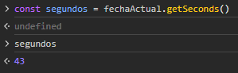
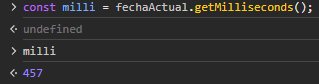

# Date

Hay dos grupos de métodos Date. Hay metodos set y get que usan local time y otros UTC (Tiempo universal coordinado).

## Local: get

**getFullYear()**

Devuelve el año de una fecha especifica o de una actual.

```
const fechaActual = new Date();
const añoActual = fechaActual.getFullYear();
```


**getMonth()**

 Devuelve el mes actual, se muestra desde el mes 0 hasta el 11 que es diciembre.

```
const mesActual = fechaActual.getMonth();
```


**getDate()**

Devuelve el día de la fecha actual o la que se le de:

```
const fecha = fechaActual.getDate();
```


**getHours()**

Devuelve la hora local que tenga configurada el computador iniciando desde la hora 0.

```
const hora = fechaActual.getHours();
```


**getMinutes()**

Devuelve los minutos de la hora actual configurada en el computador.

```
const minutos = fechaActual.getMinutes();	
```


**getSeconds()**

Devuelve los segundos de la hora configurada en computador.

```
const segundos = fechaActual.getSeconds();
```



**getMilliseconds()**

Devuelve los milisegundos de la hora configurada en la computadora.

 ```
 const milli = fechaActual.getMilliseconds();
 ```



**getDay()**

Devuelve el día de una fecha

```
const day = fechaActual.getDay();
```


## Local: set

**setFullYear()**

Fija el año completo para una fecha especifica de acuerdo a la zona horaria local.

```
fechaActual.setFullYear(1997);
```


**setMonth()**

Fija el mes para una fecha especifica de acuerdo a la zona horaria local.

```
fechaActual.setMonth(5);
```


**setDate()**

Fija el día para una fecha especifica de acuerdo a la zona horaria local.

```
fechaActual.setDate(6);
```


**setHours()**

Define la hora para una fecha especifica de acuerdo a la zona horaria local.

```
fechaActual.setHours(16);
```


**setMinutes()**

Define los minutos para una fecha especifica de acuerdo a la zona horaria local.

```
fechaActual.setMinutes(58);
```


**setSeconds()**

Define los segundos para una fecha especifica de acuerdo a la zona horaria local.

```
fechaActual.setSeconds(23);
```


## UTC: get

1. **`getUTCDate()`**: Devuelve el día del mes en formato UTC.
2. **`getUTCDay()`**: Devuelve el día de la semana en formato UTC (0 para domingo, 1 para lunes, etc.).
3. **`getUTCFullYear()`**: Devuelve el año en formato UTC.
4. **`getUTCHours()`**: Devuelve la hora en formato UTC.
5. **`getUTCMinutes()`**: Devuelve los minutos en formato UTC.
6. **`getUTCSeconds()`**: Devuelve los segundos en formato UTC.
7. **`getUTCMilliseconds()`**: Devuelve los milisegundos en formato UTC.
8. **`toUTCString()`**: Devuelve una cadena de texto que representa la fecha y hora en formato UTC.

## UTC: set

1. **`setUTCDate(día)`**: Establece el día del mes en formato UTC. Puedes pasar un valor entre 1 y 31.
2. **`setUTCDay(día)`**: Establece el día de la semana en formato UTC. Puedes pasar un valor entre 0 (domingo) y 6 (sábado).
3. **`setUTCFullYear(año)`**: Establece el año en formato UTC.
4. **`setUTCHours(hora)`**: Establece la hora en formato UTC. Puedes pasar un valor entre 0 y 23.
5. **`setUTCMinutes(minuto)`**: Establece los minutos en formato UTC. Puedes pasar un valor entre 0 y 59.
6. **`setUTCSeconds(segundo)`**: Establece los segundos en formato UTC. Puedes pasar un valor entre 0 y 59.
7. **`setUTCMilliseconds(milisegundo)`**: Establece los milisegundos en formato UTC. Puedes pasar un valor entre 0 y 999.